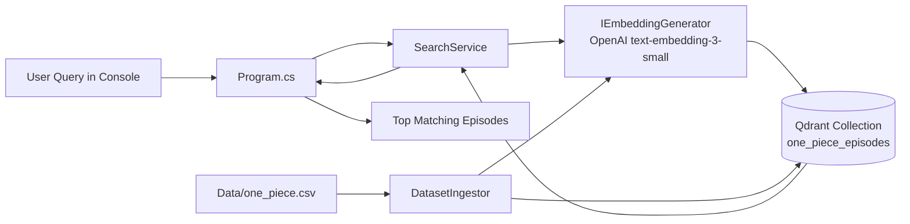

# one-piece-api

A .NET 9 console app for semantic search over One Piece episode summaries using OpenAI embeddings and Qdrant vector search.

## Architecture



## Project Layout

- `src/one-piece-api/Program.cs`: composition root, DI registration, interactive search loop.
- `src/one-piece-api/Ingestion/DatasetIngestor.cs`: CSV ingestion and embedding generation.
- `src/one-piece-api/Retrieval/SearchService.cs`: query embedding + vector similarity search.
- `src/one-piece-api/Models/EpisodeRecord.cs`: vector-store record schema.
- `src/one-piece-api/Data/one_piece.csv`: source dataset.

## Run

1. Start Qdrant locally on `localhost:6334`.
2. Set `OpenAI__ApiKey` in your environment.
3. Build and run:

```bash
dotnet build src/one-piece-api/one-piece-api.csproj
dotnet run --project src/one-piece-api/one-piece-api.csproj
```

## First-Time Ingestion

The ingestion call is currently commented out in `Program.cs`:

```csharp
// await ingestor.IngestCsvAsync("./Data/one_piece.csv");
```

Uncomment and run once to populate the `one_piece_episodes` collection, then comment it back if you do not want to re-index on every start.
