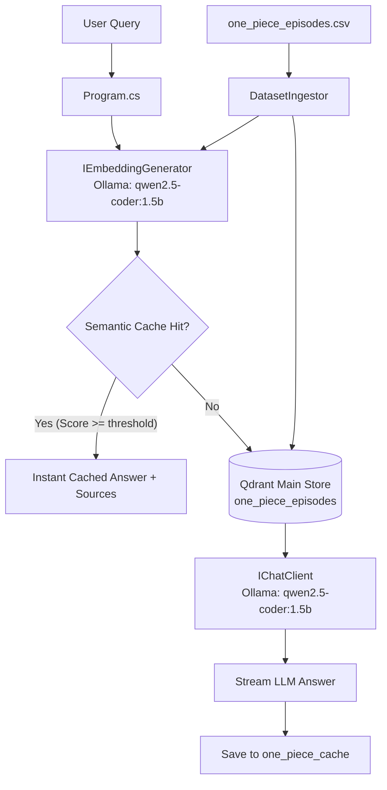

# One Piece RAG API

A .NET 9 console application demonstrating Retrieval-Augmented Generation (RAG) over One Piece episode summaries. The application uses a local Ollama client for both embedding generation and text completion, paired with a Qdrant vector store for high-performance retrieval and semantic caching.

---

## Architecture



---

## Project Layout

- `src/one-piece-api/Program.cs`: Composition root, dependency injection configuration, and interactive query loop.
- `src/one-piece-api/Ingestion/DatasetIngestor.cs`: Reads episode metadata from CSV, generates embeddings, and indexes them into Qdrant.
- `src/one-piece-api/Retrieval/SearchService.cs`: Queries the database for similar episodes using text queries or precomputed vector embeddings.
- `src/one-piece-api/Retrieval/SemanticCacheService.cs`: Handles cache hits and saves responses in Qdrant with deterministic FNV-1a query hashing.
- `src/one-piece-api/Models/EpisodeRecord.cs`: Schema for episodes in the database.
- `src/one-piece-api/Models/CacheRecord.cs`: Schema for cached query-answer pairs in the database.
- `src/one-piece-api/Models/ConfigOptions.cs`: Strongly-typed settings records.
- `src/one-piece-api/Data/one_piece_episodes.csv`: Source dataset containing episode titles and details.

---

## Dependencies & Setup

The project runs using local containers for dependency isolation.

### 1. Run via Docker Compose (Recommended)
This launches Qdrant, Ollama, pulls the required local LLM/embedding model `qwen2.5-coder:1.5b`, and starts the development workspace:
```bash
docker compose -f .devcontainer/docker-compose.yml up -d
```

### 2. Manual Local Setup
If you want to run services manually:
- Start **Qdrant** locally on port `6334`.
- Start **Ollama** locally on port `11434` and pull the required model:
  ```bash
  ollama pull qwen2.5-coder:1.5b
  ```

---

## Configuration

Settings are configured in `src/one-piece-api/appsettings.json`:
```json
{
    "Ollama": {
        "BaseUrl": "http://localhost:11434",
        "ModelId": "qwen2.5-coder:1.5b"
    },
    "Ingestion": {
        "RunOnStart": true,
        "CsvFilePath": "data/one_piece_episodes.csv"
    },
    "SemanticCache": {
        "Enabled": true,
        "SimilarityThreshold": 0.95,
        "CollectionName": "one_piece_cache"
    }
}
```

- `Ingestion:RunOnStart`: Automatically resets and rebuilds the episode vector database from the CSV on start. Set to `false` after the first run to preserve indexing.
- `SemanticCache:Enabled`: Turns semantic caching on or off.
- `SemanticCache:SimilarityThreshold`: The minimum cosine similarity score (typically `0.95` or higher) required to trigger a cache hit.

---

## Run & Verify

### Build and Run the App
To run the interactive CLI query session:
```bash
dotnet run --project src/one-piece-api/one-piece-api.csproj
```
*(Make sure to execute the command from the `src/one-piece-api` directory or configure the environment variables correctly so `appsettings.json` is located).*

### Run Unit Tests
We use xUnit for unit and integration testing:
```bash
dotnet test tests/one-piece-api.Tests/one-piece-api.Tests.csproj
```
