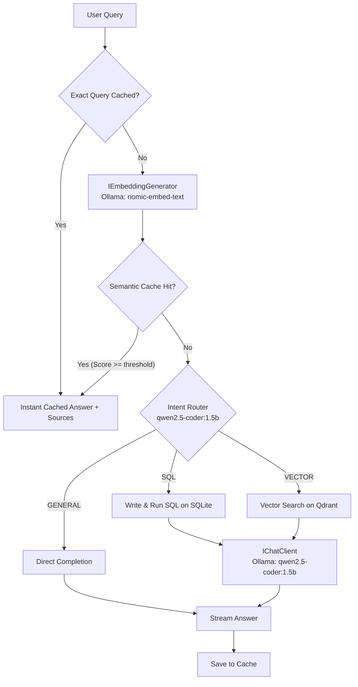

# One Piece RAG API

A .NET 10 console application demonstrating a **Hybrid SQL-RAG Agent** over One Piece episode summaries. The application uses a local Ollama client for query routing, SQL generation, and text completion, paired with a local SQLite database for structured data calculations and a Qdrant vector store for high-performance semantic retrieval and caching.

---

## Architecture



---

## Project Layout

- `src/one-piece-api/Program.cs`: Composition root, dependency injection configuration, and the prompt-driven router/executor query loop.
- `src/one-piece-api/Ingestion/DatasetIngestor.cs`: Seeds episode records into both SQLite and the Qdrant vector index on start.
- `src/one-piece-api/Retrieval/OnePieceDbContext.cs`: Code-first EF Core model for the episode table.
- `src/one-piece-api/Retrieval/SqliteDatabaseService.cs`: Manages schema creation, batched inserts, and executing generated SELECT statements over a read-only connection.
- `src/one-piece-api/Retrieval/SearchService.cs`: Queries the Qdrant database for similar episodes using vector embeddings.
- `src/one-piece-api/Retrieval/SemanticCacheService.cs`: Handles cache checks and saves responses in Qdrant with deterministic FNV-1a query hashing.
- `src/one-piece-api/Models/EpisodeRecord.cs`: Schema for episodes in the database.
- `src/one-piece-api/Models/CacheRecord.cs`: Schema for cached query-answer pairs.
- `src/one-piece-api/Models/ConfigOptions.cs`: Strongly-typed settings records.
- `src/one-piece-api/Data/one_piece_episodes.csv`: Source dataset containing episode titles and details.

---

## Dependencies & Setup

The project runs using local containers for dependency isolation.

### 1. Run via Docker Compose (Recommended)
This launches Qdrant, Ollama, pulls the required models (`qwen2.5-coder:1.5b` for chat and routing, `nomic-embed-text` for embeddings), and starts the development workspace:
```bash
docker compose -f .devcontainer/docker-compose.yml up -d
```

### 2. Manual Local Setup
If you want to run services manually:
- Start **Qdrant** locally on port `6334`.
- Start **Ollama** locally on port `11434` and pull the required models:
  ```bash
  ollama pull qwen2.5-coder:1.5b   # chat, routing, SQL generation
  ollama pull nomic-embed-text     # embeddings (768 dimensions)
  ```

---

## Configuration

Settings are configured in `src/one-piece-api/appsettings.json`:
```json
{
    "Ollama": {
        "BaseUrl": "http://localhost:11434",
        "ModelId": "qwen2.5-coder:1.5b",
        "EmbeddingModelId": "nomic-embed-text"
    },
    "Ingestion": {
        "RunOnStart": true,
        "CsvFilePath": "Data/one_piece_episodes.csv"
    },
    "SemanticCache": {
        "Enabled": true,
        "SimilarityThreshold": 0.95,
        "CollectionName": "one_piece_cache"
    }
}
```

- `Ollama:EmbeddingModelId`: The embedding model. Changing it changes the vector width, so `EmbeddingSchema.Dimensions` must be updated to match and every collection re-ingested. The app checks this on start and exits with a clear message on a mismatch.
- `Ingestion:CsvFilePath`: Relative paths resolve against the build output directory, not the working directory.
- `Ingestion:RunOnStart`: Automatically resets and rebuilds both SQLite tables and the episode vector database from the CSV on start. The semantic cache is cleared alongside them.
- `SemanticCache:Enabled`: Turns semantic caching on or off.
- `SemanticCache:SimilarityThreshold`: The minimum cosine similarity score (typically `0.95` or higher) required to trigger a cache hit.

---

## Run & Verify

### Build and Run the App
To run the interactive CLI query session:
```bash
dotnet run --project src/one-piece-api/one-piece-api.csproj
```

### Run Unit Tests
We use xUnit for testing:
```bash
dotnet test
```
