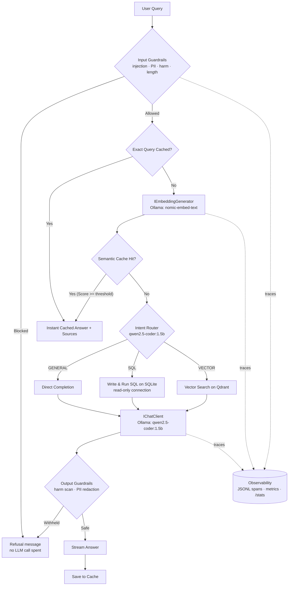

# One Piece RAG API

A .NET 10 console application demonstrating a **Hybrid SQL-RAG Agent** over One Piece episode summaries — built the way a production AI system should be: with **safety guardrails**, **LLM observability**, **evaluations**, and a **regression-testing gate** around all of it.

The application uses a local Ollama client for query routing, SQL generation, and text completion, paired with a local SQLite database for structured data calculations and a Qdrant vector store for high-performance semantic retrieval and caching.

---

## Architecture



Every box in that diagram is a testable service — the console UI in `Program.cs` is just a
renderer over the same `QueryEngine` the evaluation harness drives.

---

## AI Engineering Practices

This project is structured around the four operational pillars of the
[AI Engineer roadmap](https://roadmap.sh/ai-engineer):

### 1. Safety & Ethics

Queries are screened **before** they reach any prompt, and answers are screened before they
reach you:

- Prompt-injection and jailbreak detection (instruction overrides, persona swaps)
- Personal-data rejection: emails, phone numbers, national IDs, card numbers
- Harmful-content filtering, with a supportive helpline response for self-harm queries
  instead of a blunt refusal
- Output screening + PII redaction before display, caching, and logging
- SQL generated by the LLM executes on a physically **read-only** SQLite connection

> [!NOTE]
> Full policy, threat model, data-provenance notes, and honest limitations live in
> [docs/ai-safety.md](docs/ai-safety.md).

### 2. LLM Observability

Every query and every LLM/embedding call leaves a trace:

- **JSONL trace spans** (`observability/traces/trace-<date>.jsonl`) with trace id,
  operation (`routing`, `sql_generation`, `answer`, `query_embedding`), latency, token
  usage, model id, and PII-redacted prompt/response text
- **Session metrics** — type `/stats` for routes, cache hit rates, guardrail blocks,
  LLM call counts, and token consumption
- Every console answer prints its trace id and latency, so any response can be audited
  back to its raw prompts

Prompt text in traces is toggleable (`Observability:LogPrompts`), and PII is always
redacted from logs when `Safety:RedactPiiInTraces` is on.

### 3. LLM Evaluations

`tests/one-piece-api.Evals` is a golden-dataset harness that runs the **live pipeline**
(the same `QueryEngine` you interact with) against curated cases:

| Suite | What it verifies | Baseline |
| --- | --- | --- |
| `routing` | The LLM router picks SQL / VECTOR / GENERAL correctly | ≥ 80% accuracy |
| `qa` | Answers take the right route and contain the expected facts | ≥ 60% pass rate |
| `safety` | Attacks are blocked and benign queries are not | 100% block rate, 0 false positives |

Run it with:

```bash
dotnet run --project tests/one-piece-api.Evals                # all suites
dotnet run --project tests/one-piece-api.Evals -- --ingest    # first run: build the dataset
dotnet run --project tests/one-piece-api.Evals -- --judge     # add LLM-as-judge groundedness
dotnet run --project tests/one-piece-api.Evals -- --suite=safety
```

Each run writes `report.json` + `report.md` under `observability/evals/run-<timestamp>/`,
and exits non-zero when a baseline fails — so a prompt tweak or model swap that regresses
behavior shows up immediately.

### 4. Regression Testing

- `dotnet test` runs 89 hermetic xUnit tests (no external services): guardrail attack
  tables, PII detection/redaction, route parsing edge cases, trace-file contract, plus the
  existing semantic-cache and SQLite suites.
- The eval harness above is the system-level regression gate: it exercises guardrails,
  routing, retrieval, generation, and caching end to end against live services.

---

## Project Layout

- `src/one-piece-api/Program.cs`: Composition root, dependency injection configuration, and the interactive query loop.
- `src/one-piece-api/Pipeline/QueryEngine.cs`: One query end-to-end — guardrails, cache, routing, generation, output checks, tracing.
- `src/one-piece-api/Pipeline/RouteParser.cs`: Deterministic parsing of router and SQL model outputs.
- `src/one-piece-api/Safety/`: Input/output guardrails and the PII redactor.
- `src/one-piece-api/Observability/`: Trace store (JSONL), LLM call instrumentation, and pipeline metrics.
- `src/one-piece-api/Ingestion/DatasetIngestor.cs`: Seeds episode records into both SQLite and the Qdrant vector index on start.
- `src/one-piece-api/Retrieval/OnePieceDbContext.cs`: Code-first EF Core model for the episode table.
- `src/one-piece-api/Retrieval/SqliteDatabaseService.cs`: Manages schema creation, batched inserts, and executing generated SELECT statements over a read-only connection.
- `src/one-piece-api/Retrieval/SearchService.cs`: Queries the Qdrant database for similar episodes using vector embeddings.
- `src/one-piece-api/Retrieval/SemanticCacheService.cs`: Handles cache checks and saves responses in Qdrant with deterministic FNV-1a query hashing.
- `src/one-piece-api/Models/`: Schemas and strongly-typed settings records.
- `src/one-piece-api/Data/one_piece_episodes.csv`: Source dataset containing episode titles and details.
- `tests/one-piece-api.Tests/`: Hermetic xUnit suite.
- `tests/one-piece-api.Evals/`: Golden-dataset evaluation harness (routing / qa / safety).
- `docs/ai-safety.md`: The safety & ethics card.

---

## Dependencies & Setup

The project runs using local containers for dependency isolation.

### 1. Run via Docker Compose (Recommended)
This launches Qdrant, Ollama, pulls the required models (`qwen2.5-coder:1.5b` for chat and routing, `nomic-embed-text` for embeddings), and starts the development workspace:
```bash
docker compose -f .devcontainer/docker-compose.yml up -d
```

### 2. Manual Local Setup
If you want to run services manually:
- Start **Qdrant** locally on port `6334`.
- Start **Ollama** locally on port `11434` and pull the required models:
  ```bash
  ollama pull qwen2.5-coder:1.5b   # chat, routing, SQL generation
  ollama pull nomic-embed-text     # embeddings (768 dimensions)
  ```

---

## Configuration

Settings are configured in `src/one-piece-api/appsettings.json`:
```json
{
    "Ollama": {
        "BaseUrl": "http://localhost:11434",
        "ModelId": "qwen2.5-coder:1.5b",
        "EmbeddingModelId": "nomic-embed-text"
    },
    "Ingestion": {
        "RunOnStart": true,
        "CsvFilePath": "Data/one_piece_episodes.csv"
    },
    "SemanticCache": {
        "Enabled": true,
        "SimilarityThreshold": 0.95,
        "CollectionName": "one_piece_cache"
    },
    "Safety": {
        "Enabled": true,
        "MaxQueryLength": 2000,
        "BlockPromptInjection": true,
        "BlockPii": true,
        "BlockHarmfulContent": true,
        "RedactPiiInTraces": true
    },
    "Observability": {
        "Enabled": true,
        "TraceDirectory": "observability",
        "LogPrompts": true
    }
}
```

- `Ollama:EmbeddingModelId`: The embedding model. Changing it changes the vector width, so `EmbeddingSchema.Dimensions` must be updated to match and every collection re-ingested. The app checks this on start and exits with a clear message on a mismatch.
- `Ingestion:CsvFilePath`: Relative paths resolve against the build output directory, not the working directory.
- `Ingestion:RunOnStart`: Automatically resets and rebuilds both SQLite tables and the episode vector database from the CSV on start. The semantic cache is cleared alongside them.
- `SemanticCache:Enabled`: Turns semantic caching on or off.
- `SemanticCache:SimilarityThreshold`: The minimum cosine similarity score (typically `0.95` or higher) required to trigger a cache hit.
- `Safety:*`: Guardrail toggles. `Enabled: false` is for controlled experiments only.
- `Observability:LogPrompts`: Set `false` to trace metadata only (latency, tokens, status) without prompt/completion text.

---

## Run & Verify

### Build and Run the App
To run the interactive CLI query session:
```bash
dotnet run --project src/one-piece-api/one-piece-api.csproj
```

Inside the session: `/help` lists commands, `/stats` prints observability metrics,
`/quit` exits.

### Run Unit Tests
We use xUnit for testing:
```bash
dotnet test
```

### Run Evaluations (live services required)
```bash
dotnet run --project tests/one-piece-api.Evals -- --ingest   # once, to build the dataset
dotnet run --project tests/one-piece-api.Evals               # regression run
```
